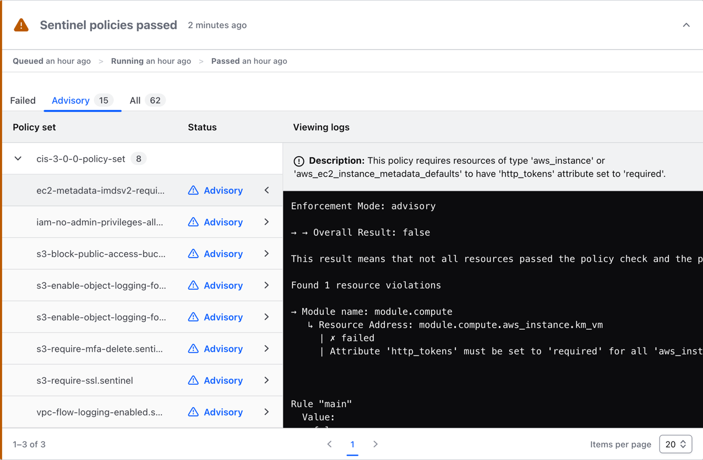

## Terraform module to create policy sets for OOTB sentinel policies
This repository hosts a terraform module [ootb-policy](./ootb-policy/) to create Policy sets for OOTB policies written in Sentinel.

---

## Table of Contents
- [Prerequisites](#Prerequisites)
- [Setup](#setup)
- [Policy Evaluation UX](#policy-evaluation-ux)

---

## Prerequisites

↥ [back to top](#table-of-contents)

This demo setup assumes that you already have completed the following:

1. [Created a GitHub Organization](https://help.github.com/en/enterprise/2.16/admin/user-management/creating-organizations)
1. [Created a fine-grained personal access token](https://docs.github.com/en/authentication/keeping-your-account-and-data-secure/managing-your-personal-access-tokens#creating-a-fine-grained-personal-access-token) in GitHub with the following settings:
    - **Expiration:** 7 days
    - **Resource Owner:** hashicorp
    - **Repository Access:** All repositories
    - **Repository Permissions:**
        - **Contents:** Read-only
        - **Metadata:** Read-only

    > **Important!**
    >
    > Save the generated token somewhere safe because you will be using it at a later stage as the value for the `gh_pac_token` input variable.

1. [Signed up or have access to Terraform Cloud](https://app.terraform.io/signup/account)
1. [Finished the Getting Started with Terraform Cloud](https://developer.hashicorp.com/terraform/tutorials/cloud-get-started)

---

## Setup

↥ [back to top](#table-of-contents)

1. Login to Terraform Cloud via the CLI and follow the prompts

    ```bash
    $ terraform login
    ```

    > **Important!**
    >
    > Save the generated token somewhere safe as you may want to reuse it at a later stage.

1. Create a `secret.auto.tfvars` file in the [example](./example/) directory that contains the following:

    ```terraform
    tfe_organization_name = "foo"
    gh_pac_token          = "github_pat_11**"
    tfe_workspace_names   = ["dev_workspace_foo", "prod_workspace_bar"]
    ```
    > **Note:**
    >
    > The `.gitignore` has been configured to exclude all `*.auto.tfvars` files in order to prevent the leaking of secrets.

2. Change directories to the [example](./example/) directory which should now have the following structure:

    ```bash
    .
    ├── main.tf
    ├── secret.auto.tfvars
    └── variables.tf
    ```
3. Initialize the Terraform working directory

    ```bash
    $ terraform init

    Initializing the backend...
    Initializing modules...
    - cis_v1-2-0_policies in ../ootb-policy
    - cis_v1-4-0_policies in ../ootb-policy
    - cis_v3-0-0_policies in ../ootb-policy

    Initializing provider plugins...
    - Finding hashicorp/tfe versions matching "0.55.0"...
    - Finding hashicorp/github versions matching "6.2.1"...
    - Finding latest version of hashicorp/null...
    - Installing hashicorp/tfe v0.55.0...
    - Installed hashicorp/tfe v0.55.0 (signed by HashiCorp)
    - Installing hashicorp/github v6.2.1...
    - Installed hashicorp/github v6.2.1 (signed by HashiCorp)
    - Installing hashicorp/null v3.2.2...
    - Installed hashicorp/null v3.2.2 (signed by HashiCorp)

    Terraform has created a lock file .terraform.lock.hcl to record the provider
    selections it made above. Include this file in your version control repository
    so that Terraform can guarantee to make the same selections by default when
    you run "terraform init" in the future.

    Terraform has been successfully initialized!

    You may now begin working with Terraform. Try running "terraform plan" to see
    any changes that are required for your infrastructure. All Terraform commands
    should now work.

    If you ever set or change modules or backend configuration for Terraform,
    rerun this command to reinitialize your working directory. If you forget, other
    commands will detect it and remind you to do so if necessary.
    ```

3. Review the plan
    ```bash
    $ terraform plan

    module.cis_v1-2-0_policies.data.github_release.this: Reading...
    module.cis_v1-4-0_policies.data.github_release.this: Reading...
    module.cis_v3-0-0_policies.data.github_release.this: Reading...
    module.cis_v1-2-0_policies.data.github_release.this: Read complete after 0s [id=159650121]
    module.cis_v1-4-0_policies.data.github_release.this: Read complete after 0s [id=159650229]
    module.cis_v3-0-0_policies.data.github_release.this: Read complete after 0s [id=159650404]
    module.cis_v3-0-0_policies.data.tfe_workspace_ids.workspaces: Reading...
    module.cis_v1-2-0_policies.data.tfe_workspace_ids.workspaces: Reading...
    module.cis_v1-4-0_policies.data.tfe_workspace_ids.workspaces: Reading...
    module.cis_v3-0-0_policies.data.tfe_workspace_ids.workspaces: Read complete after 2s [id=aqit/299802669]
    module.cis_v1-2-0_policies.data.tfe_workspace_ids.workspaces: Read complete after 2s [id=aqit/299802669]
    module.cis_v1-4-0_policies.data.tfe_workspace_ids.workspaces: Read complete after 2s [id=aqit/299802669]

    Terraform used the selected providers to generate the following execution plan. Resource actions are indicated with the following symbols:
      + create
     <= read (data resources)

    Terraform will perform the following actions:

      # module.cis_v1-2-0_policies.data.tfe_slug.this will be read during apply
      # (depends on a resource or a module with changes pending)
     <= data "tfe_slug" "this" {
          + id          = (known after apply)
          + source_path = "../ootb-policy/cis-1-2-0/unzipped"
        }

      # module.cis_v1-2-0_policies.null_resource.cleanup will be created
      + resource "null_resource" "cleanup" {
          + id       = (known after apply)
          + triggers = {
              + "timestamp" = (known after apply)
            }
        }

      # module.cis_v1-2-0_policies.null_resource.download_release will be created
      + resource "null_resource" "download_release" {
          + id       = (known after apply)
          + triggers = {
              + "timestamp" = (known after apply)
            }
        }

      # module.cis_v1-2-0_policies.tfe_policy_set.workspace_scoped_policy_set will be created
      + resource "tfe_policy_set" "workspace_scoped_policy_set" {
          + agent_enabled       = true
          + description         = "Policy set created via terraform to evaluate resources against Sentinel policies"
          + global              = false
          + id                  = (known after apply)
          + kind                = "sentinel"
          + name                = "cis-1-2-0-policy-set"
          + organization        = "aqit"
          + overridable         = false
          + policy_tool_version = "0.26.0"
          + slug                = (known after apply)
          + workspace_ids       = [
              + "ws-Ykerhv5JMiMTZDLj",
            ]
        }

      # module.cis_v1-4-0_policies.data.tfe_slug.this will be read during apply
      # (depends on a resource or a module with changes pending)
     <= data "tfe_slug" "this" {
          + id          = (known after apply)
          + source_path = "../ootb-policy/cis-1-4-0/unzipped"
        }

      # module.cis_v1-4-0_policies.null_resource.cleanup will be created
      + resource "null_resource" "cleanup" {
          + id       = (known after apply)
          + triggers = {
              + "timestamp" = (known after apply)
            }
        }

      # module.cis_v1-4-0_policies.null_resource.download_release will be created
      + resource "null_resource" "download_release" {
          + id       = (known after apply)
          + triggers = {
              + "timestamp" = (known after apply)
            }
        }

      # module.cis_v1-4-0_policies.tfe_policy_set.workspace_scoped_policy_set will be created
      + resource "tfe_policy_set" "workspace_scoped_policy_set" {
          + agent_enabled       = true
          + description         = "Policy set created via terraform to evaluate resources against Sentinel policies"
          + global              = false
          + id                  = (known after apply)
          + kind                = "sentinel"
          + name                = "cis-1-4-0-policy-set"
          + organization        = "aqit"
          + overridable         = false
          + policy_tool_version = "0.26.0"
          + slug                = (known after apply)
          + workspace_ids       = [
              + "ws-Ykerhv5JMiMTZDLj",
            ]
        }

      # module.cis_v3-0-0_policies.data.tfe_slug.this will be read during apply
      # (depends on a resource or a module with changes pending)
     <= data "tfe_slug" "this" {
          + id          = (known after apply)
          + source_path = "../ootb-policy/cis-3-0-0/unzipped"
        }

      # module.cis_v3-0-0_policies.null_resource.cleanup will be created
      + resource "null_resource" "cleanup" {
          + id       = (known after apply)
          + triggers = {
              + "timestamp" = (known after apply)
            }
        }

      # module.cis_v3-0-0_policies.null_resource.download_release will be created
      + resource "null_resource" "download_release" {
          + id       = (known after apply)
          + triggers = {
              + "timestamp" = (known after apply)
            }
        }

      # module.cis_v3-0-0_policies.tfe_policy_set.workspace_scoped_policy_set will be created
      + resource "tfe_policy_set" "workspace_scoped_policy_set" {
          + agent_enabled       = true
          + description         = "Policy set created via terraform to evaluate resources against Sentinel policies"
          + global              = false
          + id                  = (known after apply)
          + kind                = "sentinel"
          + name                = "cis-3-0-0-policy-set"
          + organization        = "aqit"
          + overridable         = false
          + policy_tool_version = "0.26.0"
          + slug                = (known after apply)
          + workspace_ids       = [
              + "ws-Ykerhv5JMiMTZDLj",
            ]
        }

    Plan: 9 to add, 0 to change, 0 to destroy.
    ```

4. Apply the changes
    ```bash
    $ terraform apply

    module.cis_v1-4-0_policies.data.github_release.this: Reading...
    module.cis_v1-2-0_policies.data.github_release.this: Reading...
    module.cis_v3-0-0_policies.data.github_release.this: Reading...
    module.cis_v1-4-0_policies.data.github_release.this: Read complete after 0s [id=159650229]
    module.cis_v1-2-0_policies.data.github_release.this: Read complete after 0s [id=159650121]
    module.cis_v3-0-0_policies.data.github_release.this: Read complete after 0s [id=159650404]
    module.cis_v1-4-0_policies.data.tfe_workspace_ids.workspaces: Reading...
    module.cis_v3-0-0_policies.data.tfe_workspace_ids.workspaces: Reading...
    module.cis_v1-2-0_policies.data.tfe_workspace_ids.workspaces: Reading...
    module.cis_v3-0-0_policies.data.tfe_workspace_ids.workspaces: Read complete after 1s [id=aqit/299802669]
    module.cis_v1-4-0_policies.data.tfe_workspace_ids.workspaces: Read complete after 1s [id=aqit/299802669]
    module.cis_v1-2-0_policies.data.tfe_workspace_ids.workspaces: Read complete after 1s [id=aqit/299802669]

    Terraform used the selected providers to generate the following execution plan. Resource actions are indicated with the following symbols:
      + create
     <= read (data resources)

    Terraform will perform the following actions:

      # module.cis_v1-2-0_policies.data.tfe_slug.this will be read during apply
      # (depends on a resource or a module with changes pending)
     <= data "tfe_slug" "this" {
          + id          = (known after apply)
          + source_path = "../ootb-policy/cis-1-2-0/unzipped"
        }

      # module.cis_v1-2-0_policies.null_resource.cleanup will be created
      + resource "null_resource" "cleanup" {
          + id       = (known after apply)
          + triggers = {
              + "timestamp" = (known after apply)
            }
        }

      # module.cis_v1-2-0_policies.null_resource.download_release will be created
      + resource "null_resource" "download_release" {
          + id       = (known after apply)
          + triggers = {
              + "timestamp" = (known after apply)
            }
        }

      # module.cis_v1-2-0_policies.tfe_policy_set.workspace_scoped_policy_set will be created
      + resource "tfe_policy_set" "workspace_scoped_policy_set" {
          + agent_enabled       = true
          + description         = "Policy set created via terraform to evaluate resources against Sentinel policies"
          + global              = false
          + id                  = (known after apply)
          + kind                = "sentinel"
          + name                = "cis-1-2-0-policy-set"
          + organization        = "aqit"
          + overridable         = false
          + policy_tool_version = "0.26.0"
          + slug                = (known after apply)
          + workspace_ids       = [
              + "ws-Ykerhv5JMiMTZDLj",
            ]
        }

      # module.cis_v1-4-0_policies.data.tfe_slug.this will be read during apply
      # (depends on a resource or a module with changes pending)
     <= data "tfe_slug" "this" {
          + id          = (known after apply)
          + source_path = "../ootb-policy/cis-1-4-0/unzipped"
        }

      # module.cis_v1-4-0_policies.null_resource.cleanup will be created
      + resource "null_resource" "cleanup" {
          + id       = (known after apply)
          + triggers = {
              + "timestamp" = (known after apply)
            }
        }

      # module.cis_v1-4-0_policies.null_resource.download_release will be created
      + resource "null_resource" "download_release" {
          + id       = (known after apply)
          + triggers = {
              + "timestamp" = (known after apply)
            }
        }

      # module.cis_v1-4-0_policies.tfe_policy_set.workspace_scoped_policy_set will be created
      + resource "tfe_policy_set" "workspace_scoped_policy_set" {
          + agent_enabled       = true
          + description         = "Policy set created via terraform to evaluate resources against Sentinel policies"
          + global              = false
          + id                  = (known after apply)
          + kind                = "sentinel"
          + name                = "cis-1-4-0-policy-set"
          + organization        = "aqit"
          + overridable         = false
          + policy_tool_version = "0.26.0"
          + slug                = (known after apply)
          + workspace_ids       = [
              + "ws-Ykerhv5JMiMTZDLj",
            ]
        }

      # module.cis_v3-0-0_policies.data.tfe_slug.this will be read during apply
      # (depends on a resource or a module with changes pending)
     <= data "tfe_slug" "this" {
          + id          = (known after apply)
          + source_path = "../ootb-policy/cis-3-0-0/unzipped"
        }

      # module.cis_v3-0-0_policies.null_resource.cleanup will be created
      + resource "null_resource" "cleanup" {
          + id       = (known after apply)
          + triggers = {
              + "timestamp" = (known after apply)
            }
        }

      # module.cis_v3-0-0_policies.null_resource.download_release will be created
      + resource "null_resource" "download_release" {
          + id       = (known after apply)
          + triggers = {
              + "timestamp" = (known after apply)
            }
        }

      # module.cis_v3-0-0_policies.tfe_policy_set.workspace_scoped_policy_set will be created
      + resource "tfe_policy_set" "workspace_scoped_policy_set" {
          + agent_enabled       = true
          + description         = "Policy set created via terraform to evaluate resources against Sentinel policies"
          + global              = false
          + id                  = (known after apply)
          + kind                = "sentinel"
          + name                = "cis-3-0-0-policy-set"
          + organization        = "aqit"
          + overridable         = false
          + policy_tool_version = "0.26.0"
          + slug                = (known after apply)
          + workspace_ids       = [
              + "ws-Ykerhv5JMiMTZDLj",
            ]
        }

    Plan: 9 to add, 0 to change, 0 to destroy.

    Do you want to perform these actions?
      Terraform will perform the actions described above.
      Only 'yes' will be accepted to approve.

      Enter a value: yes
    ```
---

## Policy Evaluation UX

↥ [back to top](#table-of-contents)

1. In Terraform, navigate to one of the workspaces that you defined in the `tfe_workspace_names` variable and trigger a new run by clicking the `+ new run` button.

2. Review and expand the Sentinel policies run card to view the state of the policy evaluation results.



3. In the case of a failure, discard the run and resolve the compliance by updating the configuration that is associated with the HCP Terraform workspace.

    > **Note!**
    >
    > You should not encounter an error when viewing the logs. If you do encounter an error, please reach out to the policy team being sure
    > to provide as much information as possible.

4. Commit and push the new changes to the GitHub repository

5. Trigger a new run in HCP Terraform, and review the Sentinel policies run card to view the state of the policy evaluation results.

---
